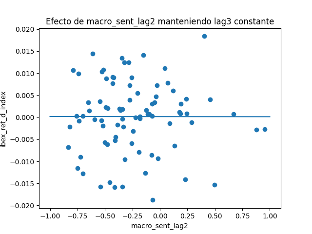
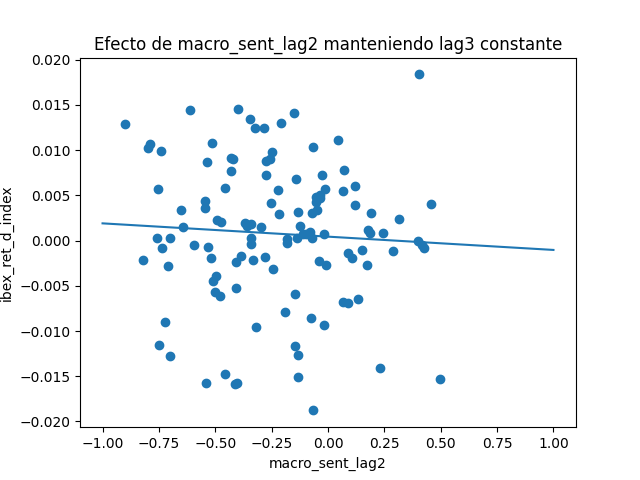

# Plataforma Inteligente de Análisis Bursátil

Autor: Antonio Cruz Vela

Curso: Developer 10x

# Resumen ejecutivo

Este proyecto presenta el desarrollo de una plataforma inteligente de
análisis bursátil centrada en el mercado español (IBEX-35), cuyo
objetivo es integrar en un único sistema la automatización de la ingesta
y actualización de datos, el análisis macroeconómico basado en
documentos no estructurados mediante técnicas NLP, y la exploración de
modelos de predicción temporal modernos basados en deep learning.

La plataforma combina un backend en Python (FastAPI), una base de datos
local (SQLite) y un frontend web ligero, junto con módulos analíticos
especializados: un agente autónomo de carga de datos, un pipeline RAG
documental con análisis de sentimiento macroeconómico y un modelo
Transformer para predicción bursátil.

El proyecto no persigue la construcción de un sistema de trading
automático ni la maximización de métricas predictivas, sino demostrar un
pipeline completo, coherente y explicable, capaz de analizar,
contextualizar y explorar relaciones entre información macroeconómica y
comportamiento del mercado. Los resultados confirman que la principal
limitación reside en la escasez y asincronía de la señal macroeconómica
relevante.

# 1. Concepto central del proyecto

El proyecto desarrolla una plataforma de análisis bursátil completamente
funcional que integra tres pilares tecnológicos:

1.  Agentes autónomos capaces de mantener actualizadas las bases de
    datos bursátiles (IBEX-35) mediante procesos automáticos de
    extracción e ingesta.

2.  Un sistema RAG (Retrieval-Augmented Generation) que combina
    publicaciones del Banco de España, BCE y Reserva Federal con
    información local del mercado español, ofreciendo respuestas
    contextualizadas y trazables.

3.  Un modelo Transformer de predicción bursátil, entrenado sobre series
    temporales del IBEX-35, con previsiones multistep (hasta 5 días
    vista) usando ventanas deslizantes de 60 días.

La plataforma integra frontend + backend, un agente de actualización, un
motor de inteligencia financiera (RAG) y un módulo de forecasting basado
en deep learning, constituyendo una herramienta unificada para analizar,
explicar y explorar el comportamiento del mercado bursátil español.

# 2. Introducción y objetivos del proyecto

## 2.1 Integrar información económica de alta calidad para análisis inteligente

-   Obtener automáticamente datos y publicaciones oficiales del Banco de
    > España, BCE, Fed y otros.

-   Incorporar noticias económicas nacionales relevantes (Expansión, El
    > Confidencial, etc.).

-   Extraer conocimiento mediante RAG con citación de fuentes y contexto
    > semántico.

## 2.2 Automatizar la recolección y actualización de datos bursátiles

-   Desarrollar un agente autónomo que descargue, limpie y almacene
    > datos del IBEX-35.

-   Mantener el sistema actualizado en SQLite sin intervención manual.

## 2.3 Correlacionar sentimiento económico con comportamiento de mercado

-   Aplicar modelos de análisis de sentimiento financiero (FinBERT /
    > RoBERTuito).

-   Unificar series temporales: sentimiento diario vs. rendimiento del
    > IBEX-35.

-   Analizar correlaciones y relaciones temporales.

## 2.4 Desarrollar un modelo Transformer para predicción bursátil

-   Implementar un modelo basado en encoder Transformer.

-   Entrenar sobre ventanas de 60 días y predecir los próximos 5 días.

## 2.5 Ofrecer una interfaz integrada y explicativa

-   Consultar el estado del mercado.

-   Ejecutar consultas RAG con justificación documental.

-   Visualizar tendencias de sentimiento y correlaciones.

-   Inspeccionar predicciones y métricas del modelo Transformer.

El proyecto se ha diseñado con un enfoque full-stack, integrando backend
en Python (FastAPI), base de datos SQLite y frontend web en
HTML/JavaScript, con el objetivo de cubrir conceptos clave trabajados
durante el curso Developer 10x.

# 3. Arquitectura general del sistema

-   Base de datos local (SQLite): contiene datos históricos de mercado y
    > metadatos de compañías.

-   Backend API (FastAPI): endpoints REST para consulta, actualización y
    > ejecución de módulos analíticos (RAG/sentimiento/correlación y
    > Transformer).

-   Frontend web: interfaz ligera en HTML/JavaScript para interacción
    > visual con el sistema.

# 4. Diseño de la base de datos

El sistema utiliza una base de datos SQLite con tres tablas principales:

-   companies: metadatos de las compañías del IBEX-35 (ticker, sector
    > ICB, capitalización, free float, etc.).

-   stock_market: cotizaciones históricas (open, high, low, close,
    > volumen) por fecha y ticker.

-   ibex_index: cotizaciones OHLCV del índice IBEX-35.

Esta estructura desacopla la información estática de empresa de los
datos dinámicos de mercado, facilitando la consulta desde el frontend y
la actualización incremental desde el resto de módulos.

#  

# 5. Módulo 1 - Frontend

## 5.1 Objetivo del frontend

El frontend proporciona una interfaz sencilla, clara y responsive que
permite visualizar compañías, seleccionar valores, lanzar consultas al
backend y mostrar resultados gráficos y textuales. Se prioriza la
funcionalidad y la claridad frente a la complejidad visual.

## 5.2 Diseño de la interfaz

-   Panel izquierdo: contenedor de salidas (gráficas/textuales) y grid
    > con compañías cargadas desde /api/companies.

-   Panel derecho: botones de acción (consulta, actualización de datos y
    > limpieza del área de salida).

El diseño es responsive mediante CSS Grid y media queries.

## 5.3 Comunicación frontend-backend

El frontend se comunica con el backend mediante llamadas fetch a
endpoints REST. Principales endpoints:

-   GET /api/companies: carga inicial del grid de compañías.

-   GET /api/companies/ticker: datos de una compañía concreta.

-   GET /api/tickers: lista de tickers desde la tabla companies.

-   GET /api/stock/ticker: últimas cotizaciones de un ticker.

-   POST /api/multi: consulta conjunta de datos para tickers
    > seleccionados.

-   GET /api/debug-count/ticker: número de cotizaciones de un ticker.

-   POST /api/update: ejecuta el agente y devuelve resumen del proceso.

-   POST /api/run-model: ejecuta el sistema RAG (modos: regresión lag
    > 2-3, forward 3 días o clasificación).

-   GET /api/pipeline/rag: resumen del corpus RAG (documentos y últimas
    > fechas).

-   GET /api/pipeline/sentiment: resumen de sentimiento macro agregado
    > (macro_market_daily.csv).

-   GET /api/pipeline/features: resumen del dataset de features
    > (mercado + sentimiento).

-   GET /api/pipeline/sentiment_files: resumen de ficheros intermedios
    > del pipeline.

-   GET /results/mode: JSON de resultados del modo seleccionado.

-   GET /api/plot/mode: PNG del último run del modo seleccionado.

-   GET /api/transformer/status: estado del transformer.

-   GET /api/transformer/metrics: métricas obtenidas.

-   GET /api/transformer/plot/name: devuelve un plot de resultados.

-   GET /api/transformer/preds: últimas predicciones del test.

Este enfoque desacopla completamente la lógica de presentación de la
lógica de negocio.

#  

# 6. Módulo 2 - Agente de carga de datos bursátiles

## 6.1 Motivación del uso de un agente

La adquisición de datos bursátiles presenta distintos escenarios
(compañías sin datos, con datos parciales o ya actualizadas).
Automatizar la decisión sobre qué proceso ejecutar en cada caso es un
problema adecuado para introducir un agente inteligente.

## 6.2 Rol y responsabilidades del agente

-   Analizar el estado actual de los datos en la base de datos.

-   Decidir qué tipo de carga es necesaria.

-   Ejecutar el proceso correspondiente.

-   Registrar el resultado de la operación.

## 6.3 Tipos de operaciones gestionadas por el agente

4.  Carga completa (full load): para tickers seleccionados que no
    existen en stock_market.

5.  Carga incremental: para tickers con histórico incompleto, cargando
    únicamente los días faltantes.

6.  Actualización diaria: para tickers ya actualizados, verificando si
    existen nuevos datos recientes.

## 6.4 Integración del agente con la API

El agente se integra en el backend mediante el endpoint /api/update,
invocable desde el frontend. La respuesta incluye un resumen
estructurado de la operación por ticker.

#  

# 7. Módulo 3 - NLP Macro: RAG, análisis de sentimiento y relación con el mercado

## 7.1 Objetivo del módulo

El objetivo es extraer información macroeconómica no estructurada
(documentos y noticias) y transformarla en señales cuantitativas
relacionables con la evolución del IBEX. El enfoque busca entender si
existe relación temporal entre sentimiento macro y retornos, y bajo qué
condiciones puede emerger.

## 7.2 Captura y organización de documentos (RAG documental)

### 7.2.1 Fuentes documentales

-   Español: Banco de España (BDE) y medios económicos generalistas
    > (general_es).

-   Inglés: Banco Central Europeo (BCE), Reserva Federal (FED) y medios
    > internacionales (general_eng).

Los documentos se obtienen principalmente vía RSS, con frecuencia
temporal no uniforme.

### 7.2.2 Arquitectura RAG

-   Almacenamiento en un corpus estructurado por fuente.

-   Indexación para búsquedas semánticas futuras.

-   Trazabilidad: fuente, fecha, idioma y documento original.

En esta fase, el RAG actúa como infraestructura de ingesta y
organización del conocimiento.

### 7.2.3 Resumen del corpus

-   Aproximadamente 1500 documentos macroeconómicos.

-   Distribuidos en categorías por idioma y procedencia.

-   Cobertura temporal desde 2018 hasta la actualidad.

## 7.3 Análisis de sentimiento documental

### 7.3.1 Sentimiento por documento

-   score: polaridad media del documento.

-   pct_signal: proporción de fragmentos con señal significativa.

-   n_trozos: número de fragmentos procesados.

### 7.3.2 Filtrado de ruido

Para reducir ruido: score != 0 y pct_signal != 0. Esto reduce el volumen
a un subconjunto con señal real.

### 7.3.3 Agregación temporal

-   Series daily (macro_market_daily.csv), weekly y por fuente.

-   macro_sent, macro_signal, macro_docs, macro_wsum, y has_macro.

## 7.4 Integración con datos de mercado

### 7.4.1 Proxy de mercado

-   Retornos diarios (ibex_ret_d).

-   Número de acciones contribuyentes (n_stocks).

-   Filtro: n_stocks \>= 12 para asegurar representatividad.

### 7.4.2 Merge macro-mercado

El merge combina series diarias de mercado con series macro
event-driven, resultando en un dataset diario escaso pero limpio.

## 7.5 Construcción de features temporales

### 7.5.1 Lags de sentimiento

-   macro_sent_lag1, lag2, lag3.

-   macro_signal_lag1, lag2, lag3.

Una fila es utilizable solo si existen valores válidos en lags y retorno
de mercado.

### 7.5.2 Correlaciones rolling

Correlaciones móviles de 21 días entre retornos y sentimiento lagged
como medida exploratoria de estabilidad.

## 7.6 Análisis de correlación y resultados

-   La correlación es débil pero no aleatoria.

-   Tiende a aumentar para lags de 2-3 días.

-   Mejora cuando existen eventos consecutivos.

## 7.7 El concepto de macro_wsum

macro_wsum captura el peso informativo agregado del sentimiento diario
(intensidad de señal, fragmentos con señal y coherencia del día).
Permite pasar de \'hay noticias\' a \'hay peso macro suficiente\'.

-   macro_wsum = 0: no hay señal macroeconómica relevante.

-   macro_wsum ≈ 1: día con señal clara y consistente.

-   macro_wsum \> 1: múltiples documentos o señal reforzada.

has_macro = True si y solo si macro_wsum \> 0.

## 7.8 Conclusiones del módulo

-   El sentimiento macroeconómico relevante es escaso por naturaleza.

-   La frecuencia de documentos es el factor limitante principal.

-   El uso de lags exige eventos cercanos en el tiempo.

-   El pipeline es coherente, reproducible y extensible.

-   El sistema puede crecer con más fuentes, mayor frecuencia o técnicas
    de propagación temporal del sentimiento.

#  

# 8. Módulo 4 - Deep Learning: Transformer para predicción bursátil

## 8.1 Motivación y objetivos

Se incorporó un modelo de deep learning para explotar dependencias
temporales de medio plazo en datos del IBEX-35. El objetivo no fue
maximizar métricas predictivas, sino explorar el uso de Transformers en
series financieras, diseñar un sistema modular y evaluar su valor frente
a baselines.

## 8.2 Dataset y formulación del problema

### 8.2.1 Fuente de datos

El modelo se entrena con el índice IBEX-35 diario, obtenido de la base
SQLite del proyecto (≈3 años de datos).

### 8.2.2 Ventanas y horizonte

-   Ventana de entrada (lookback): 60 días.

-   Horizonte de predicción: retorno logarítmico acumulado a 5 días
    > (P5).

### 8.2.3 Features utilizadas

-   Retornos logarítmicos (1, 5 y 20 días).

-   Ratios de medias móviles.

-   Volatilidad rolling.

-   Rango intradiario (high-low) y estructura de velas (wicks).

-   Variables normalizadas de volumen (cuando disponibles).

No se incluyeron variables macro/sentimiento por tamaño muestral
insuficiente para deep learning.

## 8.3 Arquitectura del modelo Transformer

-   Proyección lineal de entrada a un espacio latente.

-   Positional encoding para información temporal.

-   Bloques Transformer Encoder (self-attention + FFN + normalización).

-   Agregación temporal usando el embedding del último timestep.

-   Capa final de regresión para el retorno P5.

El diseño se mantiene deliberadamente sencillo, evitando
sobreparametrización.

## 8.4 Entrenamiento y función de pérdida

-   Split temporal: 70% train, 15% valid, 15% test (sin leakage).

-   Pérdida: Huber loss para robustez ante outliers.

-   Regularización y early stopping con monitorización de curvas de
    > pérdida.

## 8.5 Evaluación y resultados

### 8.5.1 Métricas utilizadas

-   MAE

-   RMSE

-   R2

-   Directional Accuracy (signo correcto del retorno)

### 8.5.2 Resultados obtenidos

-   El baseline simple (retorno cero) obtiene mejores métricas en MAE y
    > RMSE.

-   El Transformer logra ligera mejora en directional accuracy (superior
    > al 50%).

-   R2 negativo, consistente con la dificultad de explicar varianza del
    > retorno.

### 8.5.3 Análisis cualitativo

-   Predicciones suavizadas y dispersión significativa vs. valores
    > reales.

-   No se observa sobreajuste, reforzando validez del experimento.

-   Inspección día a día mediante tabla de predicciones para
    > transparencia.

## 8.6 Integración en la plataforma

-   Backend FastAPI con endpoints dedicados.

-   Outputs estandarizados (métricas, plots, predicciones).

-   Visualización en el frontend junto al resto de módulos.

## 8.7 Limitaciones y trabajo futuro

-   Dataset reducido para deep learning y régimen de mercado limitado.

-   Enfoque exclusivamente en regresión.

-   Futuro: ampliar histórico a 5-10 años, reformular como clasificación
    > direccional, incorporar macro con mayor volumen.

## 8.8 Conclusión del módulo

El módulo Transformer valida una arquitectura moderna e integrable,
preparada para extensiones futuras. No pretende demostrar superioridad
predictiva inmediata, sino aportar una base técnica sólida y explicable.

Hemos seguido trabajando en la introducción de datos en los últimos seis
meses, logrando unos 5000 documentos y 169 filas con sentimiento válido.

Sin embargo los resultados siguen sin mostrar una correlación ni en
valores ni en sentido

Adjuntamos resumen de resultados

✅ Dataset modelado listo: 169 filas

📅 Rango modelado: 2023-05-11 → 2026-01-19

🧾 Features: \[\'macro_sent_lag2\', \'macro_sent_lag3\',
\'macro_signal_lag2\', \'macro_signal_lag3\'\]

date y_ret_d macro_sent_lag2 macro_sent_lag3 macro_signal_lag2
macro_signal_lag3

2023-05-11 0.001647 -0.124568 -0.166539 0.478261 1.000000

2023-11-06 -0.005638 -0.501675 -0.124568 1.000000 0.478261

2024-11-13 -0.000483 -0.593208 -0.587192 1.000000 1.000000

2024-12-19 -0.015321 0.498413 -0.768752 1.000000 1.000000

2025-03-11 -0.015700 -0.539464 -0.923984 1.000000 1.000000

2025-04-24 -0.002165 -0.822070 -0.425824 1.000000 0.500000

..........

2025-12-31 -0.002714 -0.176667 0.075087 0.521739 0.522727

2026-01-02 0.010666 -0.121365 -0.176667 0.382166 0.521739

2026-01-05 0.006974 -0.095655 -0.121365 0.390977 0.382166

2026-01-06 0.001856 0.004411 -0.095655 0.394366 0.390977

2026-01-07 -0.002873 -0.084472 0.004411 0.500000 0.394366

2026-01-08 0.003313 -0.073491 -0.084472 0.421053 0.500000

2026-01-09 -0.000323 -0.188039 -0.073491 0.506903 0.421053

2026-01-12 0.001405 -0.173026 -0.188039 0.512821 0.506903

2026-01-13 0.000752 -0.060432 -0.173026 0.449215 0.512821

2026-01-14 0.000486 -0.147452 -0.060432 0.438462 0.449215

2026-01-15 -0.002995 -0.169436 -0.147452 0.510274 0.438462

2026-01-16 0.003866 -0.358902 -0.169436 0.612500 0.510274

2026-01-19 -0.002575 -0.058087 -0.358902 0.573171 0.612500

📊 Métricas:

MAE: 0.0055

RMSE: 0.0077

R2: -0.0526

Directional_Accuracy: 0.6667

📐 Coeficientes:

macro_sent_lag2 -0.001469

macro_sent_lag3 0.001165

Name: coef, dtype: float64

Intercept: 0.000703

Asimismo las curvas se mantienen en pendientes ligeramente negativas o
positivas sin mostrar ninguma correlación

{width="6.1375in" height="4.602777777777778in"}

{width="6.1375in" height="4.602777777777778in"}

La herramienta se ha mostrado totalmente robusta en el procesamiento de
esos datos

Buscando información en los papers financieros, éstos anuncian
correlación entre el sentimiento negativo y los retornos a largo plazo y
entre el sentimiento positivo y los retornos a corto plazo. Seguiremos,
pues, trabajando en esa línea

# 9. Conclusiones generales del proyecto

-   Se ha construido una plataforma full-stack coherente que integra
    automatización de datos, NLP macro y forecasting.

-   La limitación principal del análisis macro-financiero es la densidad
    temporal de señal, no el modelo.

-   El pipeline NLP trata la señal macro como un evento, mejorando
    calidad y explicabilidad.

-   En predicción de retornos, modelos complejos no garantizan mejores
    métricas sin suficiente muestra y diversidad de regímenes.

-   La arquitectura modular permite ampliar fuentes, histórico y tareas
    futuras manteniendo reproducibilidad e interpretabilidad.

En conjunto, el proyecto refleja una aproximación realista, crítica y
extensible al uso de IA aplicada a finanzas, alineada con buenas
prácticas profesionales y académicas.
